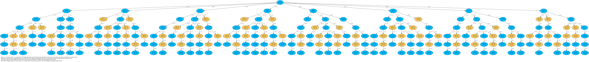

## Drawing Ellipses With Fewer Straight Lines

We attempt to optimise the runtime performance for drawing an ellipse by drawing straight lines while maintaining a pixel perfect shape.

See results running on a BBC Micro with a 2MHz 6502 CPU:

| Version               | Time in centiseconds | Percentage  time | Execute in 6502 | Execute in BASIC |
| --------------------- | :------------------: | ---- | ---- | ---- |
| Drawing individual pixels | 69 | 100% (baseline) | [here](http://bbc.godbolt.org/?autoboot&disc=https://raw.githubusercontent.com/TobyLobster/ellipse/main/ELLIPS0.SSD) | -
| Drawing axis aligned and 45 degree lines | 60 | 87% | [here](http://bbc.godbolt.org/?autoboot&disc=https://raw.githubusercontent.com/TobyLobster/ellipse/main/ELLIPS1.SSD) | [here](https://bbcmic.ro/#%7B%22v%22%3A1%2C%22program%22%3A%2210MODE%201%5Cn20PROCellipse%28160%2C128%2C58%2C100%2C-20%29%5Cn30END%5Cn40%3A%5Cn50DEFPROCellipse%28CX%25%2CCY%25%2CA%25%2CB%25%2CS%25%29%5Cn60VDU%2029%2CCX%25*4%3BCY%25*4%3B%5Cn70BB%25%3DB%25*B%25%5Cn80AA%25%3DA%25*A%25%5Cn90YYAA%25%3D0%3AAABB%25%3DAA%25*BB%25%5Cn100YYAA_DIFF%25%3DAA%25%5Cn110X1%25%3D-A%25%3AT1%25%3D-A%25*B%25%3ATT1%25%3DAABB%25%3ABT1%25%3DB%25*T1%25%3AST1%25%3DS%25*T1%25%5Cn120X2%25%3D%20A%25%3AT2%25%3D-T1%25%20%20%3ATT2%25%3DAABB%25%3ABT2%25%3D-BT1%25%20%3AST2%25%3D-ST1%25%5Cn130YS%25%3D0%3ABB2%25%3DBB%25%2F2%3ASB%25%3DS%25*B%25%3ASS%25%3DS%25*S%25%5Cn140OY1%25%3D0%3AOY2%25%3D0%3AOOX1%25%3DX1%25%3AOOX2%25%3DX2%25%3AODELTAX1%25%3D0%3AODELTAX2%25%3D0%3Acol1%25%3D1%3Acol2%25%3D2%3AREM%20used%20for%20straight%20line%20segments%5Cn150FOR%20Y%25%3D0%20TO%20B%25-1%5Cn160OX2%25%3DX2%25%3AOX1%25%3DX1%25%5Cn170DD%25%3DAABB%25-YYAA%25%3A%5Cn180%3A%5Cn190IF%20T2%25%3C%3EX2%25*B%25-Y%25*S%25%3ASTOP%20ELSE%20IF%20BT2%25%3C%3ET2%25*B%25%3ASTOP%20ELSE%20IF%20TT2%25%3C%3ET2%25*T2%25%3ASTOP%20ELSE%20IF%20ST2%25%3C%3ES%25*T2%25%3ASTOP%5Cn200IF%20T2%25%3C0%20X2%25%3DX2%25%2B1%3AT2%25%3DT2%25%2BB%25%3ATT2%25%3DTT2%25%2B2*BT2%25%2BBB%25%3ABT2%25%3DBT2%25%2BBB%25%3AST2%25%3DST2%25%2BSB%25%3AGOTO%20190%5Cn210IF%20T2%25%3D0%20GOTO%20260%5Cn220D1%25%3DTT2%25-DD%25%5Cn230BD%25%3DBT2%25%2BBB2%25%5Cn240IF%20BD%25-D1%25%20%3C%200%20X2%25%3DX2%25-1%3AT2%25%3DT2%25-B%25%3ATT2%25%3DTT2%25-2*BT2%25%2BBB%25%3ABT2%25%3DBT2%25-BB%25%3AST2%25%3DST2%25-SB%25%3AGOTO%20190%5Cn250IF%20BD%25%2BD1%25%20%3C%200%20X2%25%3DX2%25%2B1%3AT2%25%3DT2%25%2BB%25%3ATT2%25%3DTT2%25%2B2*BT2%25%2BBB%25%3ABT2%25%3DBT2%25%2BBB%25%3AST2%25%3DST2%25%2BSB%25%3AGOTO%20190%5Cn255%3A%5Cn260DELTAX2%25%3DX2%25%2BSGN%28X2%25-OX2%25%29*0-OX2%25%5Cn270IF%20DELTAX2%25%3DODELTAX2%25%20AND%20Y%25%3CB%25-1%20AND%20ABS%28DELTAX2%25%29%3C2%3AGOTO310%3AREM%20we%20are%20building%20a%20straight-line%20segment%20so%20don%27t%20draw%20anything%20for%20now%5Cn275IF%20ABS%28ODELTAX2%25%29%3D1%20AND%20DELTAX2%25%3D0%20AND%20Y%25%3CB%25-1%20AND%20Y%25%3DOY2%25%2B1%20%3AODELTAX2%25%3DDELTAX2%25%3AOOX2%25%3DOX2%25%3AGOTO310%3AREM%20fix%20for%20consecutive%20vlines%5Cn280DX%25%3DSGN%28OX2%25-OOX2%25%29%5Cn290GCOL3%2Ccol2%25%3Acol2%25%3D3-col2%25%3AMOVE%20%28OOX2%25%2BDX%25%29*4%2COY2%25*4%3ADRAW%20OX2%25*4%2C%28Y%25-1%29*4%3AMOVE%20-%28OOX2%25%2BDX%25%29*4%2C-OY2%25*4%3ADRAW-OX2%25*4%2C-%28Y%25-1%29*4%3AOY2%25%3DY%25%3AOOX2%25%3DOX2%25%3AODELTAX2%25%3DDELTAX2%25%3AREM%20finish%20off%20old%20straight-line%20segment%5Cn300%3A%5Cn310IF%20T1%25%3C%3EX1%25*B%25-Y%25*S%25%3ASTOP%20ELSE%20IF%20BT1%25%3C%3ET1%25*B%25%3ASTOP%20ELSE%20IF%20TT1%25%3C%3ET1%25*T1%25%3ASTOP%20%20ELSE%20IF%20ST1%25%3C%3ES%25*T1%25%3ASTOP%5Cn320IF%20T1%25%3E0%20X1%25%3DX1%25-1%3AT1%25%3DT1%25-B%25%3ATT1%25%3DTT1%25-2*BT1%25%2BBB%25%3ABT1%25%3DBT1%25-BB%25%3AST1%25%3DST1%25-SB%25%3AGOTO%20310%5Cn330IF%20T1%25%3D0%20GOTO%20390%5Cn340D1%25%3DTT1%25-DD%25%5Cn350BD%25%3DBB2%25-BT1%25%5Cn360IF%20BD%25-D1%25%20%3C%200%20X1%25%3DX1%25%2B1%3AT1%25%3DT1%25%2BB%25%3ATT1%25%3DTT1%25%2B2*BT1%25%2BBB%25%3ABT1%25%3DBT1%25%2BBB%25%3AST1%25%20%3D%20ST1%25%2BSB%25%3AGOTO%20310%5Cn370IF%20BD%25%2BD1%25%20%3C%200%20X1%25%3DX1%25-1%3AT1%25%3DT1%25-B%25%3ATT1%25%3DTT1%25-2*BT1%25%2BBB%25%3ABT1%25%3DBT1%25-BB%25%3AST1%25%20%3D%20ST1%25-SB%25%3AGOTO%20310%5Cn380%3A%5Cn390DELTAX1%25%3DX1%25%2BSGN%28X1%25-OX1%25%29*0-OX1%25%5Cn400IF%20DELTAX1%25%3DODELTAX1%25%20AND%20Y%25%3CB%25-1%20AND%20ABS%28DELTAX1%25%29%3C2%3AGOTO450%3AREM%20we%20are%20building%20a%20straight-line%20segment%20so%20don%27t%20draw%20anything%20for%20now%5Cn401IF%20ABS%28ODELTAX1%25%29%3D1%20AND%20DELTAX1%25%3D0%20AND%20Y%25%3CB%25-1%20AND%20Y%25%3DOY1%25%2B1%20%3AODELTAX1%25%3DDELTAX1%25%3AOOX1%25%3DOX1%25%3AGOTO450%3AREM%20fix%20for%20consecutive%20vlines%5Cn410DX%25%3DSGN%28OX1%25-OOX1%25%29%5Cn420GCOL3%2Ccol1%25%3Acol1%25%3D3-col1%25%3AMOVE%20%28OOX1%25%2BDX%25%29*4%2COY1%25*4%3ADRAW%20OX1%25*4%2C%28Y%25-1%29*4%3AMOVE%20-%28OOX1%25%2BDX%25%29*4%2C-OY1%25*4%3ADRAW-OX1%25*4%2C-%28Y%25-1%29*4%3AOY1%25%3DY%25%3AOOX1%25%3DOX1%25%3AODELTAX1%25%3DDELTAX1%25%3AREM%20finish%20off%20old%20straight-line%20segment%5Cn430%5Cn440%5Cn450TT2%25%3DTT2%25-2*ST2%25%2BSS%25%3ATT1%25%3DTT1%25-2*ST1%25%2BSS%25%3AYS%25%3DYS%25%2BS%25%3AST2%25%3DST2%25-SS%25%3AST1%25%3DST1%25-SS%25%5Cn460YYAA%25%3DYYAA%25%2BYYAA_DIFF%25%5Cn470YYAA_DIFF%25%3DYYAA_DIFF%25%2B2*AA%25%5Cn472BT2%25%3DBT2%25-SB%25%3ABT1%25%3DBT1%25-SB%25%3AT2%25%3DT2%25-S%25%3AT1%25%3DT1%25-S%25%5Cn480NEXT%5Cn481Y%25%3DB%25%5Cn482REM%20finish%20off%20old%20line%20segments%3A%5Cn485OOX2%25%3DOX2%25%3AOX2%25%3DX2%25%3ADX%25%3DSGN%28OX2%25-OOX2%25%29%5Cn486GCOL3%2Ccol2%25%3Acol2%25%3D3-col2%25%3AMOVE%20%28OOX2%25%2BDX%25%29*4%2COY2%25*4%3ADRAW%20OX2%25*4%2C%28Y%25-1%29*4%3AMOVE%20-%28OOX2%25%2BDX%25%29*4%2C-OY2%25*4%3ADRAW-OX2%25*4%2C-%28Y%25-1%29*4%3AOY2%25%3DY%25%3AOOX2%25%3DOX2%25%3AODELTAX2%25%3DDELTAX2%25%3AREM%20finish%20off%20old%20straight-line%20segment%5Cn492OOX1%25%3DOX1%25%3AOX1%25%3DX1%25%3ADX%25%3DSGN%28OX1%25-OOX1%25%29%5Cn493GCOL3%2Ccol1%25%3Acol1%25%3D3-col1%25%3AMOVE%20%28OOX1%25%2BDX%25%29*4%2COY1%25*4%3ADRAW%20OX1%25*4%2C%28Y%25-1%29*4%3AMOVE%20-%28OOX1%25%2BDX%25%29*4%2C-OY1%25*4%3ADRAW-OX1%25*4%2C-%28Y%25-1%29*4%3AOY1%25%3DY%25%3AOOX1%25%3DOX1%25%3AODELTAX1%25%3DDELTAX1%25%3AREM%20finish%20off%20old%20straight-line%20segment%5Cn495%5Cn500%3A%5Cn520REM%20finish%20off%20cap%20and%20tail%20hlines%20of%20ellipse%5Cn525GCOL0%2C3%5Cn530OX2%25%3DX2%25%3AOX1%25%3DX1%25%3ADX%25%3DSGN%28X2%25-X1%25%29%3AY%25%3DB%25%5Cn540MOVE%20%20%28OX1%25%2BDX%25%29*4%2C%20Y%25*4%3ADRAW%20%28OX2%25-DX%25%29*4%2C%20Y%25*4%5Cn550MOVE%20-%28OX1%25%2BDX%25%29*4%2C-Y%25*4%3ADRAW-%28OX2%25-DX%25%29*4%2C-Y%25*4%5Cn520%3A%5Cn530ENDPROC%22%7D)
| Drawing small straight lines (as described below) | 48 | 70% | [here](http://bbc.godbolt.org/?autoboot&disc=https://raw.githubusercontent.com/TobyLobster/ellipse/main/ELLIPS2.SSD) | -

An implementation of this algorithm is also available as a [Processing](https://processing.org)  project [here](./processing/ellipse3a.pde)

We pre-calculate a static tree structure that encodes all possible straight line renderings from a fixed starting point. To limit the size of the tree, we limit the length of the lines.

We have an existing algorithm that traces the pixels of an ellipse. Instead of drawing each pixel, we call a new routine (add_point).

Starting at the root of the tree, the routine will move a pointer from one node of the tree to one of its children (if possible) depending on the direction taken. If we run out of tree (the latest direction does not lead to a new child node), then we draw the longest straight line found in the tree so far and continue the process starting at the root of the tree again.

### Making the Tree
In particular, consider a 13x13 grid of pixels with origin at the centre. Coordinates
range from (-6,-6) to (6,6).

We investigate the rendering of each straight line from (0,0) to some other point on
the grid. There are 13x13=169 of these straight lines:


We encode each pixel move along each line into a tree.

An edge of the tree represents a move in a particular direction from one pixel to the next along a straight line.

### Directions
We represent the directions from a point X to an adjacent pixel by a number 0-8 (The
number four is unused. This is an implementation detail to optimise the speed of the
code):
```
                    678
                    3X5
                    012
```
Figure A - encoding directions

Moving from the root of the tree is in one of eight directions.

However once an initial direction is chosen the straight line then has only three directions it can continue along (since straight lines don't turn 90 degrees):
 - the same initial direction
 - one step clockwise from the initial direction
 - one step anti-clockwise from the initial direction

 For instance, if the straight line starts in direction 0, then each following pixel move for that particular straight line is in one of the three directions (3,0,1) as seen in Figure A.

### Blue and Yellow nodes
Each node in the tree is coloured blue or yellow. If a node in the tree represents the final pixel of a straight line, then we colour it blue. Yellow nodes are the remainder - intermediate nodes part way towards longer line(s).

The resulting tree looks like this:



The root has eight children, corresponding to the eight directions that can be taken from the first pixel. Each subtree's nodes from this point onwards has at most three children.

By symmetry, we see that only the first three subtrees are unique. The remainder of the subtrees are identical to one of the first three, with suitable reordering of the directions. So we get three subtrees:


Where A,B,C are directions determined by the initial direction:

| Initial direction | Subtree Root  | A | B | C |
| :---------------: | :-----------: | - | - | - |
| 0                 | node 0        | 3 | 0 | 1 |
| 1                 | node 1        | 0 | 1 | 2 |
| 2                 | node 2        | 1 | 2 | 5 |
| 3                 | node 1        | 0 | 3 | 6 |
| 4                 | -             | - | - | - |
| 5                 | node 0        | 2 | 5 | 8 |
| 6                 | node 2        | 3 | 6 | 7 |
| 7                 | node 0        | 6 | 7 | 8 |
| 8                 | node 1        | 7 | 8 | 5 |

### Implementation details
A python script (asm/create_table.py) is used to create the tree and output the appropriate data (asm/linedata.a). The runtime code (asm/ellips2.a) is the main file to assemble.

There are 93 nodes in the symmetry reduced tree, so each node can be identified by a single byte.

Each node of the tree stores three children and blue/yellow flag (four bytes total).
For speed, we store these values in four separate arrays of bytes 'child0', 'child1',
'child2', and 'isBlue'. A value of 255 means no child is present.

The root is a special case as is has eight children, which is reduced to three due to symmetry as noted above. We store a mapping from the eight possible initial directions to the root of one of the three unique subtrees. We also store the three possible continuing directions for the subtree for each initial direction.

In the runtime, at each iteration we move from a node to its child. If we run out of tree (the latest direction does not lead to a new child node), then we (a) draw the longest straight line so far encountered (from the root node to the last blue node we visited), and (b) replay any remaining yellow node moves to the new routine (recursively).

Because our ellipse is drawn in four quadrants, each quadrant has its own set of state  for traversing the tree.

### Limitations
Different operating systems can render straight lines in slightly different ways. This will affect the data produced. So the data is to some degree OS specific when relying on an OS specific line drawing routine.

### Future Development ###
This technique is not just useful for ellipses, but can be used with any shape that's drawn using adjacent pixels.

#### Optimisations
Large or squashed ellipses can have long sections of purely vertical or horizontal lines. At the moment these lines are encoded into multiple lines of length 7. It is possible to adjust the tree data so that e.g. the child of node along a vertical line can point to its parent. This turns our tree into a graph that can encode vertical and horizontal lines of any length. Similarly for diagonal (45 degree) lines and perhaps some other regular lines too.

We can coalesce identical parts of the tree to save memory.

We can move the isBlue flag into the top bit of e.g. child0, to save memory.
