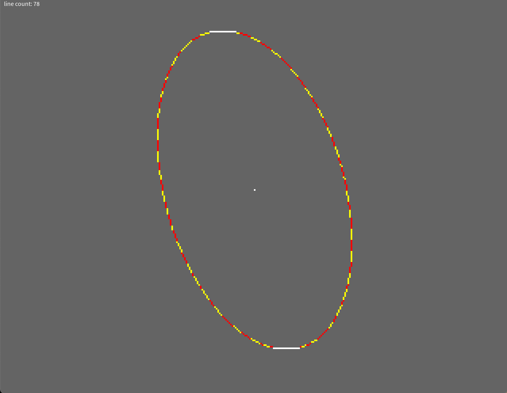

# 6502 Bresenham Sheared Ellipse

This project derives and implements a sheared Bresenham-style ellipse on a 6502 processor.

It uses only integer operations, and avoids any explicit sqrt calculations or multiplications within the main loop.

Run [6502 code in emulator](https://bbc.godbolt.org/?autoboot&disc=https://raw.githubusercontent.com/TobyLobster/ellipse/diagonals/ELLIPS2.SSD)

See [algorithm derivation](./algorithm_derivation/derivation.ipynb)

Given this algorithm, we use an innovative approach to rendering, using short straight lines that render identically to the individual pixels that would normally be drawn.

See [rendering fewer lines](./fewer_lines.md)

